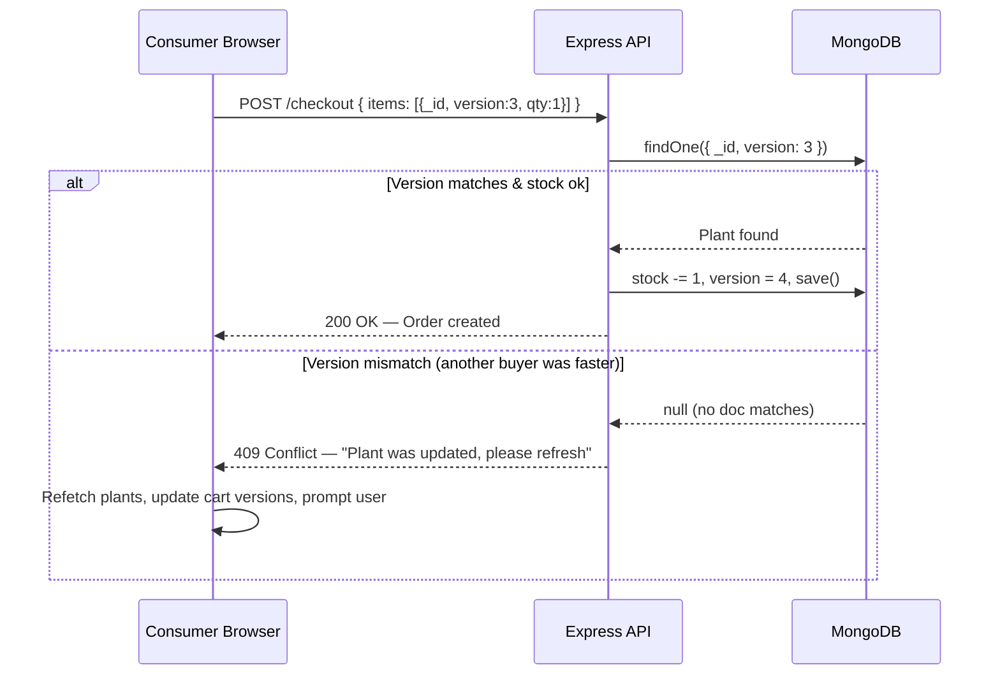

# Full-Stack E-PlantShopping Platform Upgrade

## Overview

Transform the existing static React app into a full-stack, role-based e-commerce platform for plants. A **Node.js + Express + MongoDB** backend will power three distinct user roles. The current hardcoded plant data will move into MongoDB, managed by Producers. Purchases will use **Optimistic Concurrency Control (OCC)** to safely handle simultaneous buyers without race conditions.

---

## User Review Required

> [!IMPORTANT]
> **Role Separation Summary** — confirm this matches your intent:
> - **Producer**: Registers → can `Add`, `Edit`, `Delete` their own plants. Sees only their own listings and their own sales history.
> - **Consumer**: Registers → browses ALL plants from ALL producers, adds to cart, and checks out. Cannot see who the producer is (optional — let me know if they should).
> - **Owner**: A single pre-seeded admin account. Gets a full dashboard: all users, all plants, all orders, total revenue. Cannot buy or list plants.

> [!IMPORTANT]
> **Stock / Quantity**: The existing app had no stock concept. I will add a `stock` field to each Plant. When a Consumer buys, stock decrements. If stock hits 0, the plant becomes unavailable. **Confirm if you want this.**

> [!WARNING]
> **Breaking Change**: The existing Redux store and all hardcoded plant data will be replaced. The app will require a backend server + MongoDB to run.

---

## Open Questions

> [!IMPORTANT]
> 1. Should the **Consumer see the Producer's name/farm** on the plant card, or stay anonymous?
> 2. Should the Owner be able to **manually add/remove products or users**?
> 3. Do you want **image upload** for plants (Multer/Cloudinary) or just an **image URL** field?
> 4. Should there be a **"Pending / Delivered" order status** flow, or just a simple "Purchased" record?

---

## Proposed Changes

### 1. Backend — `server/` (NEW directory inside `e-plantShopping/`)

#### [NEW] `server/package.json`
Dependencies: `express`, `mongoose`, `bcryptjs`, `jsonwebtoken`, `cors`, `dotenv`, `express-validator`

#### [NEW] `server/server.js`
Express app entry point. Connects to MongoDB, registers all routes, enables CORS for the Vite frontend on port 5173.

#### [NEW] `server/config/db.js`
Mongoose connection helper using `MONGO_URI` from `.env`.

---

#### [NEW] `server/models/User.js`
```
{ name, email, password (hashed), role: enum['producer','consumer','owner'], createdAt }
```

#### [NEW] `server/models/Plant.js`
```
{
  name, category, description, image (URL), price (Number),
  stock (Number, default 10),
  version (Number, default 0),   ← OCC key
  producer: ref → User,
  createdAt
}
```
> The `version` field is the heart of OCC. Every successful purchase increments it.

#### [NEW] `server/models/Order.js`
```
{ consumer: ref→User, items:[{plant:ref, qty, priceAtPurchase}], total, status:'completed', createdAt }
```

#### [NEW] `server/models/Transaction.js` *(audit log for Owner)*
```
{ type:'purchase'|'listing', actor:ref→User, plant:ref→Plant, detail:String, createdAt }
```

---

#### [NEW] `server/middleware/auth.js`
- `verifyToken` — validates JWT from `Authorization: Bearer <token>`
- `requireRole(...roles)` — role-based access guard

---

#### [NEW] `server/routes/auth.js`
| Method | Endpoint | Description |
|--------|----------|-------------|
| POST | `/api/auth/register` | Register as producer or consumer |
| POST | `/api/auth/login` | Login (all roles) → returns JWT |

#### [NEW] `server/routes/plants.js`
| Method | Endpoint | Role | Description |
|--------|----------|------|-------------|
| GET | `/api/plants` | Consumer/Owner | Get ALL plants (with stock > 0) |
| GET | `/api/plants/mine` | Producer | Get only MY plants |
| POST | `/api/plants` | Producer | Add a new plant |
| PUT | `/api/plants/:id` | Producer | Edit own plant |
| DELETE | `/api/plants/:id` | Producer | Delete own plant |

#### [NEW] `server/routes/orders.js`
| Method | Endpoint | Role | Description |
|--------|----------|------|-------------|
| POST | `/api/orders/checkout` | Consumer | OCC-based purchase |
| GET | `/api/orders/mine` | Consumer | My order history |

**Checkout OCC Logic (critical)**:
```
For each cart item:
  1. Find Plant by _id WHERE version === item.version (sent from frontend)
  2. If not found → version mismatch → return 409 Conflict
  3. If stock < qty → return 400 Insufficient Stock
  4. Atomically: stock -= qty, version += 1, save
  5. Log Transaction
Create Order document
```

#### [NEW] `server/routes/admin.js`
| Method | Endpoint | Description |
|--------|----------|-------------|
| GET | `/api/admin/users` | All users (producers + consumers) |
| GET | `/api/admin/plants` | All plants with producer info |
| GET | `/api/admin/orders` | All orders with buyer info |
| GET | `/api/admin/transactions` | Full audit log |
| GET | `/api/admin/stats` | Revenue, user counts, plant counts |

---

### 2. Frontend — `src/` (heavily modified)

#### [NEW] `src/api/axiosInstance.js`
Axios instance with base URL `http://localhost:5000`. An interceptor automatically attaches `Authorization: Bearer <token>` from localStorage to every request.

#### [MODIFY] `src/store/store.js`
Add `authReducer` and `plantsReducer` slices.

#### [NEW] `src/store/authSlice.js`
State: `{ user: null, token: null, role: null, isLoading, error }`
Async thunks: `loginUser`, `registerUser`, `logoutUser`

#### [NEW] `src/store/plantsSlice.js`
State: `{ plants: [], isLoading, error }`
Async thunks: `fetchAllPlants`, `fetchMyPlants`, `addPlant`, `editPlant`, `deletePlant`
> Plants from API include `_id`, `version`, `stock` — needed for OCC.

#### [MODIFY] `src/store/cartSlice.js` *(was `CartSlice.jsx`)*
Items now store `{ _id, name, image, price, version, stock, quantity }`.
New action: `checkoutCart` async thunk → calls POST `/api/orders/checkout` → clears cart on success.

---

#### [NEW] `src/components/ProtectedRoute.jsx`
Reads role from Redux auth state. Redirects unauthenticated users to `/login`. Guards role-specific routes.

#### [NEW] `src/components/Navbar.jsx`
Role-aware navbar:
- **Producer**: Logo | My Plants | Sales | Logout
- **Consumer**: Logo | Shop | Cart (with badge) | My Orders | Logout
- **Owner**: Logo | Dashboard | Users | Plants | Orders | Logout

#### [NEW] `src/components/PlantCard.jsx`
Reusable card for both Consumer shop view and Producer dashboard.

#### [NEW] `src/components/AddPlantModal.jsx`
Modal form for Producers to add/edit a plant: Name, Category, Description, Image URL, Price, Stock.

#### [NEW] `src/components/CartDrawer.jsx`
Slide-in cart panel. On checkout, calls the OCC-protected API. On 409 response, shows: *"One or more items were updated by the seller. Cart refreshed."* and re-fetches plant versions.

---

#### [NEW] `src/pages/LoginPage.jsx`
Premium dark-themed login page with role selector tabs (Producer / Consumer / Owner).

#### [NEW] `src/pages/RegisterPage.jsx`
Register form with role choice (Producer or Consumer only — Owner is pre-seeded).

#### [NEW] `src/pages/ProducerDashboard.jsx`
- My Plants grid (add/edit/delete)
- Sales summary (orders containing my plants)
- Revenue total

#### [NEW] `src/pages/ConsumerShop.jsx` *(replaces ProductList.jsx)*
- Fetches plants from API (not hardcoded)
- Category filter sidebar
- Each card shows live stock count
- Add to Cart → stored in Redux with `version` snapshot

#### [NEW] `src/pages/OwnerDashboard.jsx`
- Stats cards: Total Revenue, Total Users, Total Plants, Total Orders
- Tabs: All Users | All Plants | All Orders | Audit Log (Transactions)
- Table views with search/filter

#### [MODIFY] `src/App.jsx`
Replace state-based navigation with `react-router-dom` v6:
```
/ → Landing (public)
/login → LoginPage
/register → RegisterPage
/producer/* → ProducerDashboard (protected, role=producer)
/shop → ConsumerShop (protected, role=consumer)
/owner/* → OwnerDashboard (protected, role=owner)
```

#### [MODIFY] `src/main.jsx`
Wrap app in `<BrowserRouter>` and `<Provider store={store}>`.

#### [MODIFY] `src/index.css`
Add new CSS variables for dark/green theme, glassmorphism cards, role-specific accent colors.

---

## Optimistic Concurrency Control — How It Works



---

## Verification Plan

### Automated / Dev Testing
1. `cd server && npm run dev` — confirm Express starts on port 5000
2. `cd .. && npm run dev` — confirm Vite starts on port 5173
3. Register a **Producer**, add 3 plants → verify in MongoDB
4. Register a **Consumer**, shop + checkout → verify stock decrements
5. Simulate OCC conflict: open 2 browser tabs as different consumers, buy same last-stock item simultaneously → one gets 409
6. Login as **Owner** → verify all stats and audit log are populated

### Manual Visual Check
- Landing page still shows "Paradise Nursery" branding
- Each role sees a completely different UI after login
- Cart shows live stock warning when stock is low
- 409 conflict shows a user-friendly message, not a raw error
